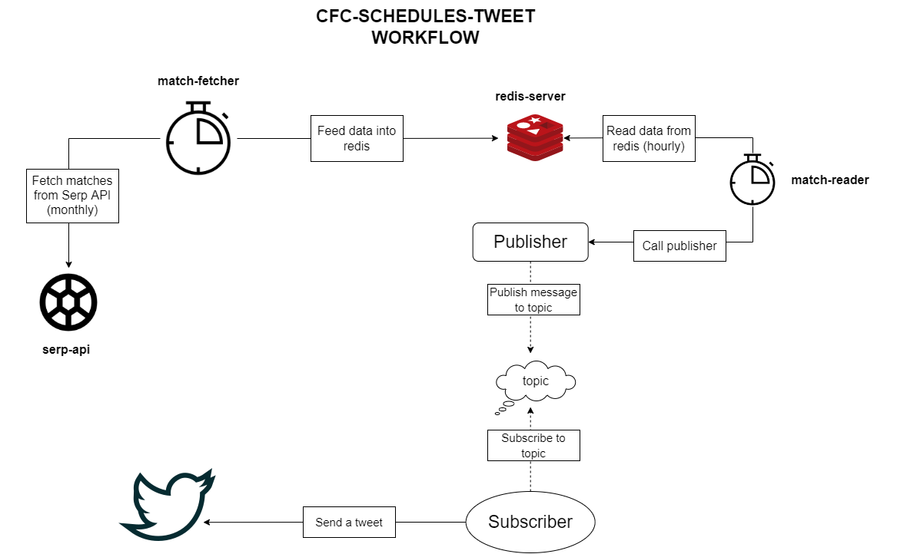

### cfc-schedules-tweet

Send tweets ahead of Chelsea FC's match!

### Feature(s)

1. Send a tweet ahead of Chelsea FC's match:
   - one day before the match
   - one hour before the match

### Example of the tweet

#### H-24 reminder

```Markdown
[Day - 1!]
#UCL // descope for now. no info for competition from the serp api
🆚 Chelsea vs Real Madrid
🏟️ Stamford Bridge // update to either `Stamford Bridge` or `Opponent's Stadium`
📅 March 20, 2022
⏱️ 2AM GMT+7

#ChelseaFC #CFCFixture
```

#### H-1 reminder

```Markdown
[Matchday !]
#UCL // descope for now. no info for competition from the serp api
🆚 Chelsea vs Real Madrid
🏟️ Stamford Bridge // update to either `Stamford Bridge` or `Opponent's Stadium`
📅 March 20, 2022
⏱️ 2AM GMT+7

#ChelseaFC #CFCFixture
```

### High-level flow


