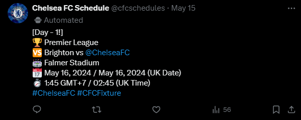
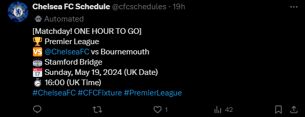
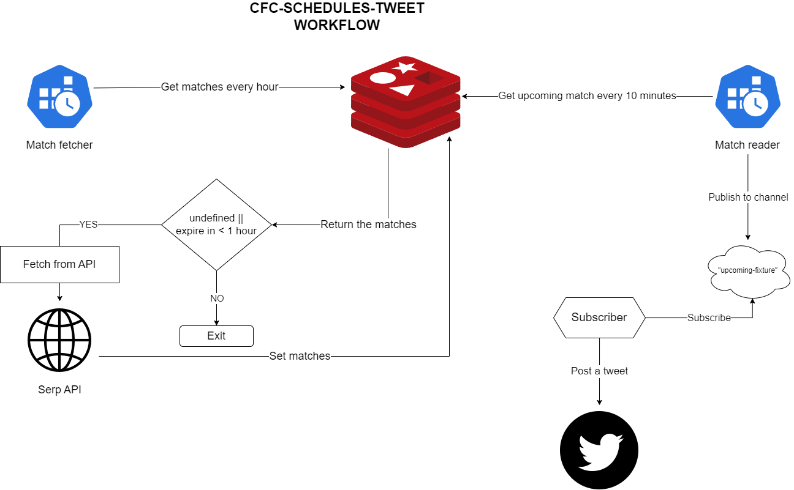

### cfc-schedules-tweet

Send tweets ahead of Chelsea FC's match!

### Feature(s)

1. Send a tweet ahead of Chelsea FC's match:
   - one day before the match
   - one hour before the match

### Example of the tweet

#### Day-1


#### Hour-1 reminder


### High-level flow



### How to run locally
1. Cron for fetching the matches
```bash
npm run match-fetcher
```
2. Cron for reading the matches from redis
```bash
npm run match-reader
```
3. Worker to subscribe to redis
```bash
npm run sub
```

### Cron scheduling
- `match-fetcher` -> runs **every hour**
- `match-reader`  -> runs **every 10 minutes**

### Test
```bash
npm run test
```
